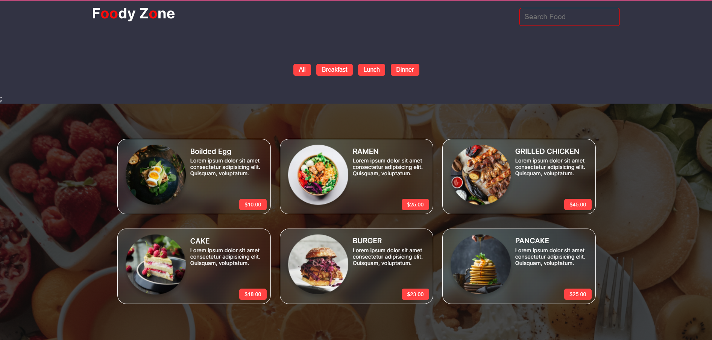

# [Food Zone](https://www.youtube.com/watch?v=i__4ul5yXFc&list=PLPppPPmk0i3j_DW1T-UbryDVhBDgaAfEp&index=5)
This project is made to practice and strengthen my ReactJS skills. The backend is not made by me.

### Design Link: [Here](https://www.figma.com/file/rephrU2FVgN8MFz6XhnP51/Learn-React-with-10-Projects?type=design&node-id=382-53&mode=design&t=dOoGzzrDw8dywGbs-0)

## Preview of Page


## New Techstack used
* [Styled Component](https://styled-components.com/) installed through ```
  npm install styled-components```